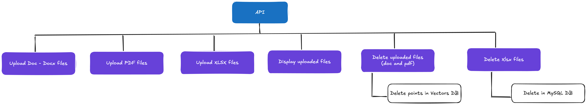

# Smart Customs Assistant

**SmartCustoms-Assistant** is a **Retrieval-Augmented Generation (RAG) chatbot** project focused on assisting users with **import/export regulations, customs procedures, and goods classification**. The chatbot leverages a **Large Language Model (LLM)** as its “brain” to generate responses, combined with a vector-embedded data store for efficient information retrieval.

---
## Table of Contents
- [Objectives](#1-objectives)
- [Overall Architecture](#2-overall-architecture)
- [Processing Pipelines](#3-processing-pipelines)
  - [PDF](#1-pdf)
  - [XLSX](#2-xlsx)
  - [DOC - DOCX](#3-doc---docx)
- [RAG Pipeline](#rag-pipeline)
  - [VectorStoreManager](#1-vectorstoremanager)
  - [CrossReranker](#2-crossreranker)
  - [SearchEngine](#3-searchengine)
- [LLM Pipeline](#llm-pipeline)
- [Key Functionalities](#key-functionalities)
  - [Chat Endpoint](#1-chat-endpoint)
  - [List Uploaded Files](#2-list-uploaded-files)
  - [Delete Uploaded File](#3-delete-uploaded-file)
  - [Upload & Process DOC/DOCX](#4-upload--process-docdocx)
  - [Upload & Process PDF](#5-upload--process-pdf)
  - [Upload & Process XLSX](#6-upload--process-xlsx)
- [Demo Deployment](#demo-deplpyment)
---

## 1. Objectives
- **Automatically answer** questions about **import/export regulations**, **customs procedures**, **HS codes**, and required documents.  
- **Optimize accuracy** by leveraging **Cross-Encoder reranking** and **Rephrase LLM** to properly interpret user queries.  
- **Handle diverse data sources**: from Excel files (structured data) to PDF/Word documents (semi-structured or unstructured data).

---

## 2. Overall Architecture
The project consists of several key steps:

### Data Ingestion
- Data provided by stakeholders come in various formats: `.pdf`, `.xlsx`, `.doc`, `.docx`.
- Each file type is processed by a specialized **Preprocessor**.

### Chunking & Preprocessing
- **Excel (structured data)**: chunk by rows (row-based).
- **Unstructured data (PDF, DOC)**: chunk by **semantic chunking** or fixed-size with overlapping.
- The result is a collection of **cleaned “text chunks”** ready for embedding.

### Embedding
- Use an **Embedding Model** (e.g., `text-embedding-ada-002`) to convert chunks into vectors.
- Store these vectors in a **Vector DB** (Qdrant, Pinecone, FAISS, etc.).

### Query → Rephrase LLM
- The user sends a query → The LLM **rephrases** it to standardize and improve search accuracy.

### Similarity Search
- Convert the rephrased query into a vector via the embedding model, then retrieve the **top k** most similar chunks from the Vector DB.

### Cross-Encoder Reranking
- A Cross-Encoder **re-evaluates** each chunk’s relevance, providing a more precise ranking.
- Select the final **top n** chunks to feed into the LLM.

### LLM Generation
- The LLM reads the relevant chunks (context) → **generates an answer**.
- The user receives the final response.

---

## 3. Processing Pipelines

### 1. PDF

- **Data Source**: PDF files that are actually scanned images, meaning traditional PDF-reading methods do not apply (no hidden text layer).
- **Requirement**: Extract text with high accuracy, especially regarding dates and crucial references (circular numbers, etc.).

Below is a sample dataset (in reality, the provided data may be less “clean”):

  

#### Approach

1. **Treat PDFs as images**  
   - Instead of viewing them as text documents, treat them as a collection of images.  
   - **Goal**: Extract content via OCR to obtain the necessary text.

2. **Use GPT-4**  
   - GPT-4 is chosen for its high accuracy, especially for complex data (dates, codes, etc.).  
   - **Issue**: GPT-4 may refuse to process images containing official seals, signatures, etc. due to safety/security policy.

3. **Workaround with YOLO OCR**  
   - Train a YOLO OCR model to **detect** (bounding boxes) official seals and signatures in the images.  
   - **Fill** (white-box) those detected areas → removing sensitive content before sending the image to GPT-4.  
   - **Result**: A “cleaned” image without stamps/signatures → GPT-4 accepts it and can extract text.

4. **Build and label the dataset**  
   - Use **Roboflow** to build and manually label bounding boxes for seals and signatures.  
   - Ensure enough variety in shapes, positions, and colors to train YOLO OCR effectively.

5. **Extract Text from Images**  
   - Extract text using GPT-4 (once the image is cleaned).  
   - The result is formatted in Markdown to preserve as much of the original structure as possible.

6. **Chunking**  
   - **Data specifics**: Typically, these documents are circulars, notices, etc., often 1–2 pages. However, some may have multiple pages, resulting in a higher token count.  
   - **Implementation**:  
     - Split by token threshold: if text exceeds a set limit, chunk based on predefined rules.  
     - Overlap between chunks: consecutive chunks overlap to maintain context and avoid missing crucial info.

---

#### References & Links
- **Notebooks finetune yolov12**   
   [Notebook Link](https://colab.research.google.com/drive/1dUP-S6qI0NOBPJUxsU7hDnHwUFXBZ_K9?authuser=2)

- **Raw Data & Data Preparation Notebook**  
  [Drive Link](https://drive.google.com/drive/folders/1nD3ke0PfkfS4P8bNWKQwbXDsn6vUw1aR?usp=sharing)

- **Dataset (Roboflow)**  
  [Dataset Link](https://app.roboflow.com/watermarkdetect/watermark-signature/browse?queryText=&pageSize=50&startingIndex=0&browseQuery=true)

- **Original Data (Cẩm nang XNK - Bộ Tài Chính)**  
  [Original Data Link](https://camnangxnk-logistics.net/tai-lieu-xuat-nhap-khau/bo-tai-chinh/)

---

### 2. XLSX

- **Data Source**: Excel (`.xlsx`) files containing relevant information across multiple columns (dates, numbers, strings, etc.).
- Sample data:

#### Approach

1. **Handle Excel files via Pandas**  
   - Read the file with `pd.read_excel(...)`.  
   - Convert everything into a DataFrame for convenient manipulation.

2. **Data Preprocessing**  
   - Remove or replace empty values (fill `""` for numeric or string columns).  
   - Convert and reformat date columns.

3. **Chunking**  
   - Typically done by **rows**: each row might include fields like `Date`, `Supplier`, `Hs code`, `Item Name`, `Quantity`, `Unit`, `Country of Origin`, etc.

---

### 3. DOC - DOCX

- **Data Source**: Word files (`.doc` or `.docx`) containing text, often government decrees from the Ministry of Finance or similar.

Sample data:

  

#### Approach

1. **Convert DOC to DOCX**  
   - Use LibreOffice in headless mode to convert `.doc` → `.docx`.  
   - Store the converted DOCX in a temporary folder.

2. **Read Word file content**  
   - Use `UnstructuredWordDocumentLoader` to load content from DOCX.  
   - If the original file is DOC, convert it first.

3. **Split text**  
   - Apply regex to split text by “Điều …”, “Khoản …”, “Mẫu số …” or relevant markers.  
   - Clean up extra whitespace.

4. **Chunking & Handling Long Sections**  
   - Measure token count per section.  
   - If a section is too long, split it into smaller chunks with some overlap to maintain continuity.

---

## RAG Pipeline

### 1. `VectorStoreManager`
- Manages **storage** and **retrieval** of vector embeddings via **Qdrant**.  
- Creates a Qdrant collection (if missing) based on **embedding dimensions**.  
- Stores text and metadata as vectors, enabling **similarity search**.

### 2. `CrossReranker`
- Improves **accuracy** by **re-ranking** the retrieved documents.  
- Uses a **CrossEncoder** model (PhoRanker) to score query-document relevance.  
- Sorts results in descending order of relevance to pick the most fitting docs.

### 3. `SearchEngine`
- Uses the VectorStore for **initial retrieval** and filters them by threshold.  
- Retrieves top-k documents (by similarity), then discards those below the threshold.  

---

## LLM Pipeline

### 1. `DataLoader`  
- Converts **JSON data** (from processed PDF, DOCX, XLSX) into lists of text and metadata.

### 2. `EmbeddingGenerator`
- Calls **OpenAI Embeddings** to turn text into vectors, supporting batch splitting and retries.

### 3. `LangChainGenerator`
- Uses **ChatOpenAI** to generate final answers.  
- If RAG-provided documents exist, it answers based on them; otherwise, it relies on general knowledge.  
- Maintains a short **conversation history** and outputs results in Markdown.

---

## Key Functionalities

### 1. Chat Endpoint
- **Route**: `POST /chat`  
- **Description**:  
  - Maintains a conversation (session) via the `session_id` cookie.  
  - If no `session_id` exists, the system automatically creates one and sets the cookie.  
  - Allows the chatbot to remember the last 3 interactions and provide answers based on the RAG pipeline (retriever + CrossReranker).

---

### 2. List Uploaded Files
- **Route**: `GET /uploaded-files`  
- **Description**:  
  - Returns a list of files currently in `data/uploaded`.  
  - Each file has: `file_name` (no extension), `file_type` (extension), and the full file name (`file`).

---

### 3. Delete Uploaded File
- **Route**: `DELETE /delete-uploaded-file`  
- **Description**:  
  - Receives `file_name` and `file_type` to delete.  
  - Removes associated vectors in Qdrant (via metadata) and deletes the physical file in `data/uploaded`.  
  - Responds with “Deleted” status and file info.

---

### 4. Upload & Process DOC/DOCX
- **Route**: `POST /upload` (Doc endpoint)  
- **Description**:  
  - Accepts `.doc` or `.docx` only (size ≤ 10MB).  
  - Saves the file to `data/uploaded`, then runs `doc_processor_pipeline` to convert content into JSON.  
  - Uses `DataLoader` to extract text, create embeddings, and store in Qdrant.  
  - Returns “Processed, embeddings created and saved to Qdrant”.

---

### 5. Upload & Process PDF
- **Route**: `POST /upload` (PDF endpoint)  
- **Description**:  
  - Accepts `.pdf` only (size ≤ 10MB).  
  - Saves the file to `data/uploaded`, then runs `pdf_processor_pipeline`.  
  - Produces JSON, then creates embeddings and stores them in Qdrant.  
  - Returns “Processed, embeddings created and saved to Qdrant”.

---

### 6. Upload & Process XLSX
- **Route**: `POST /upload` (XLSX endpoint)  
- **Description**:  
  - Accepts `.xlsx` only (size ≤ 10MB).  
  - Saves the file to `data/uploaded`, runs `xlsx_processor_pipeline` to convert content into JSON.  
  - Uses `DataLoader` to extract text, create embeddings, and store them in Qdrant.  
  - Returns “Processed, embeddings created and saved to Qdrant”.

## Demo Deplpyment

