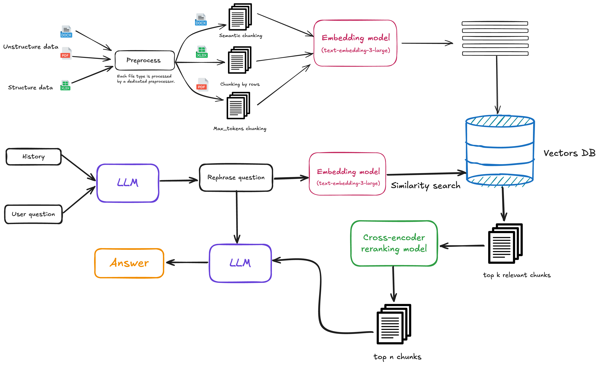
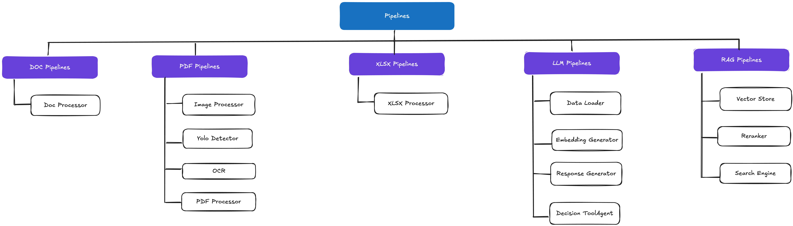
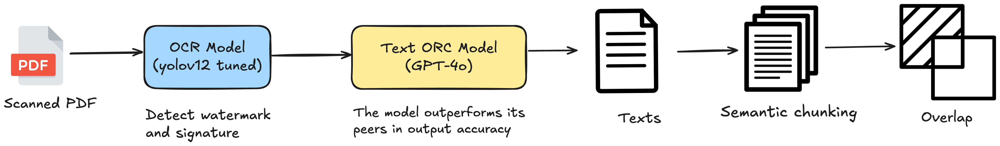
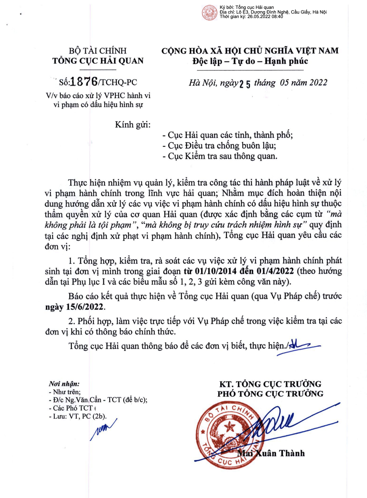
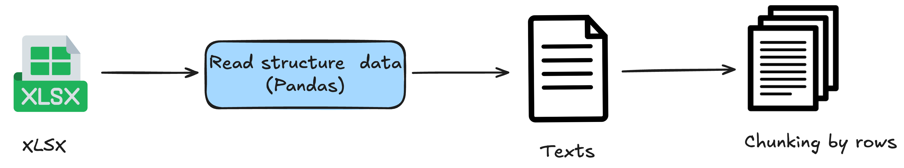
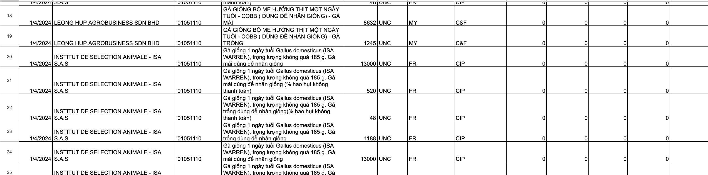
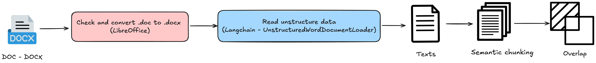
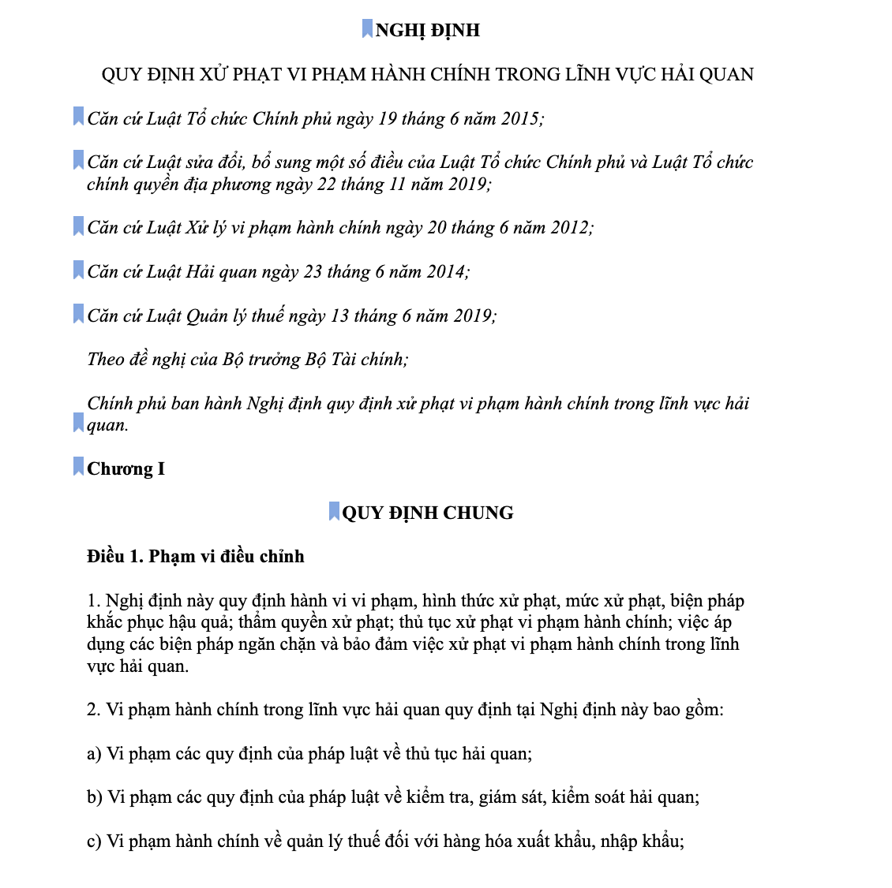

# Smart Customs Assistant
SmartCustoms-Assistant là dự án Chatbot RAG (Retrieval-Augmented Generation), tập trung hỗ trợ người dùng trong lĩnh vực xuất nhập khẩu, hải quan, và hàng hóa. Chatbot sử dụng LLM (Large Language Model) làm “bộ não” để sinh phản hồi, kết hợp với kho dữ liệu được lưu dưới dạng vector embeddings để truy xuất thông tin (retrieval) một cách hiệu quả.

## 1. Mục tiêu
- Tự động trả lời các câu hỏi liên quan đến quy định xuất nhập khẩu, thủ tục hải quan, mã HS, giấy tờ cần thiết, v.v.
- Tối ưu độ chính xác bằng cách tận dụng Cross-Encoder reranking và Rephrase LLM để hiểu đúng truy vấn người dùng.
- Xử lý đa dạng nguồn dữ liệu: Từ file Excel (dữ liệu có cấu trúc) đến tài liệu PDF/Word (dữ liệu bán cấu trúc hoặc phi cấu trúc).

## 2. Kiến trúc tổng quan
Dự án chia thành các bước chính như sau:

Data Ingestion

Dữ liệu được bên yêu cầu cung cấp dưới các dạng: `.pdf`, `x.lsx`, `.doc`, `.docx`
Mỗi loại file được chuyển qua Preprocessor chuyên biệt.
Chunking & Preprocessing

Excel (structured data): chunk theo mỗi dòng (row-based).
Unstructured data (PDF, DOC): chunk theo semantic chunking hoặc kích thước cố định + overlapping.
Kết quả là các “đoạn văn bản” (chunks) đã được làm sạch, sẵn sàng cho bước embedding.
Embedding

Sử dụng Embedding Model (ví dụ: text-embedding-ada-002) để chuyển các chunk thành vector.
Lưu trữ vector này vào Vector DB (Qdrant, Pinecone, FAISS, v.v.).
Query → Rephrase LLM

Người dùng gửi câu hỏi → LLM tái diễn giải (rephrase) truy vấn để chuẩn hóa, tăng độ chính xác khi tìm kiếm.
Similarity Search

Từ truy vấn đã rephrase, mô hình embedding → vector, tìm top k chunk tương tự nhất trong Vector DB.
Cross-Encoder Reranking

Cross-Encoder đánh giá lại mức độ liên quan của từng chunk, sắp xếp chính xác hơn.
Lấy top n chunk cuối cùng để cung cấp cho LLM.
LLM Generation

LLM đọc các chunk liên quan (context) → Sinh câu trả lời.
Người dùng nhận được phản hồi cuối cùng.

## Pipelines xử lý

### 1. PDF

### Bối cảnh và vấn đề

- **Nguồn dữ liệu**: Các file PDF dạng ảnh chụp (*scanned PDF*), không thể áp dụng các phương pháp đọc PDF truyền thống (vì không có lớp text ẩn).  
- **Yêu cầu**: Trích xuất văn bản với độ chính xác cao, đặc biệt về ngày tháng và các thông tin quan trọng về số thông tư, ...

Dưới đây là một ví dụ về dữ liệu (thực tế dữ liệu được cung cấp không đẹp như vậy):

---

### Phương án tiếp cận

1. **Xử lý PDF như ảnh**  
   - Thay vì coi PDF là tài liệu văn bản, ta coi chúng như một tập hợp các hình ảnh.  
   - **Mục tiêu**: Trích xuất nội dung bằng OCR để lấy được văn bản cần thiết.

2. **Sử dụng GPT-4**  
   - Lý do chọn GPT-4: Độ chính xác cao, đặc biệt với dữ liệu có cấu trúc phức tạp (ngày tháng, mã số...).  
   - **Vấn đề**: GPT-4 từ chối xử lý ảnh có dấu mộc, chữ ký… do vi phạm chính sách an toàn/bảo mật.

3. **Khắc phục bằng mô hình YOLO OCR**  
   - Huấn luyện mô hình YOLO OCR để **phát hiện (detect)** vị trí các dấu mộc, chữ ký trên ảnh (thông qua bounding box).  
   - **Xóa (fill) khu vực phát hiện** thành màu trắng (*white box*) → Loại bỏ nội dung nhạy cảm trước khi gửi ảnh vào GPT-4.  
   - **Kết quả**: Ảnh “làm sạch” không còn dấu mộc, chữ ký → GPT-4 chấp nhận xử lý và trích xuất văn bản.

4. **Xây dựng và gán nhãn bộ dữ liệu**  
   - Sử dụng **Roboflow** để xây dựng tập dữ liệu và gán nhãn thủ công (annotate bounding box cho vùng dấu mộc, chữ ký).  
   - Tạo tập dữ liệu đủ đa dạng về hình dạng, vị trí, màu sắc của dấu mộc/chữ ký, giúp YOLO OCR học nhận diện chính xác.

5. **Extract Text từ Hình Ảnh**
	- Trích xuất văn bản từ ảnh sử dụng GPT-4o. Kết quả trả về được định dạng dưới dạng Markdown nhằm bảo toàn tối đa cấu trúc ban đầu của dữ liệu.

6. **Chunking**

	- Đặc thù dữ liệu:
		Thông thường, các tài liệu là thông tư, thông báo,... chỉ chiếm từ 1 đến 2 trang PDF.
		Tuy nhiên, có trường hợp tài liệu có thể bao gồm nhiều trang, dẫn đến số lượng token cao hơn.
	- Phương pháp thực hiện:
	Chia theo ngưỡng token: Khi số lượng token vượt qua giới hạn đặt sẵn, dữ liệu sẽ được chia thành các chunk dựa trên các quy tắc định nghĩa.
Overlap giữa các chunk: Các chunk trong cùng một tài liệu sẽ có phần chồng lấn nhằm đảm bảo tính liên tục và không bỏ sót thông tin quan trọng.
---
###  Tham khảo & liên kết

- **Raw Data & Notebook Chuẩn bị data**  
  [Drive Link](https://drive.google.com/drive/folders/1nD3ke0PfkfS4P8bNWKQwbXDsn6vUw1aR?usp=sharing)

- **Dataset (Roboflow)**  
  [Dataset Link](https://app.roboflow.com/watermarkdetect/watermark-signature/browse?queryText=&pageSize=50&startingIndex=0&browseQuery=true)

- **Original data (Cẩm nang XNK - Bộ Tài Chính)**
	[Original Data Link](https://camnangxnk-logistics.net/tai-lieu-xuat-nhap-khau/bo-tai-chinh/)

 
### 2. XLSX

### Bối cảnh và vấn đề

Nguồn dữ liệu: Các file Excel (xlsx) chứa thông tin cần trích xuất, bao gồm nhiều cột với kiểu dữ liệu khác nhau (ngày tháng, số, chuỗi...).
Dưới đây là một ví dụ về dữ liệu:

1. Xử lý file Excel bằng Pandas
Đọc file Excel bằng pd.read_excel(...).
Chuyển toàn bộ dữ liệu thành một DataFrame để thuận tiện thao tác.
2. Tiền xử lý dữ liệu
Loại bỏ giá trị trống (bằng cách điền "" cho cột dạng số hoặc chuỗi).
Chuyển đổi và định dạng lại cột ngày tháng .
3. Chunking
	Chia dữ liệu theo các hàng , với mỗi chunk gồm: `Ngày`,  `Nhà cung cấp`,	`Hs code`,	`Tên hàng`,	`Lượng`,  `Đơn vị tính`, 	`Tên nuớc xuất xứ`, ...

## 3. DOC - DOCX

### Bối cảnh và Yêu cầu

- **Nguồn dữ liệu**: Các file Word (DOC hoặc DOCX) chứa văn bản cần xử lý. Thường là các NGHỊ ĐỊNH của CHÍNH PHỦ

Dưới đây là một ví dụ về dữ liệu:

---

### Phương Án Tiếp Cận

1. **Chuyển đổi file DOC sang DOCX**  
   - Sử dụng LibreOffice trong chế độ headless để chuyển đổi file DOC sang DOCX.  
   - Tạo thư mục tạm để lưu trữ file DOCX chuyển đổi.

2. **Đọc Nội Dung File Word**  
   - Dùng `UnstructuredWordDocumentLoader` để load nội dung từ file DOCX.  
   - Nếu file gốc là DOC, chuyển đổi sang DOCX trước khi đọc.

3. **Phân Đoạn Văn Bản**  
   - Áp dụng biểu thức chính quy để chia văn bản thành các đoạn dựa trên các quy tắc (ví dụ: “Điều …”, “Khoản …”, “Mẫu số …”).  
   - Làm sạch và chuẩn hoá các đoạn văn (loại bỏ khoảng trắng thừa).

4. **Chia Nhỏ (Chunking) và Xử Lý Đoạn Văn**  
   - Đo số token của mỗi đoạn.  
   - Nếu số token vượt ngưỡng quy định, chia đoạn thành các chunk nhỏ theo số lượng token.  
   - Áp dụng kỹ thuật overlap giữa các chunk để đảm bảo tính liên tục của nội dung.
