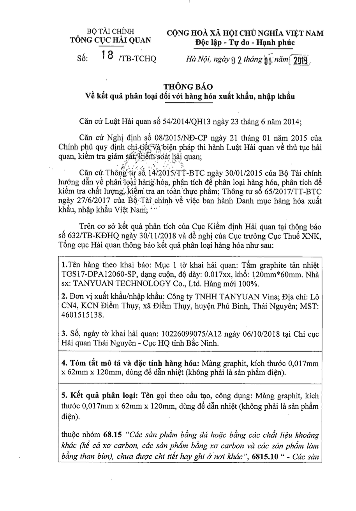

# Smart Customs Assistant

**SmartCustoms-Assistant** is a **Retrieval-Augmented Generation (RAG)** chatbot project focused on assisting users with **import/export regulations, customs procedures, and goods classification**. The chatbot leverages the reasoning capability of a **Large Language Model (LLM)** to generate responses, combined with a **vector-based retrieval system** for grounding answers in relevant documents.

To **enhance factual accuracy and reduce hallucinations** in specialized customs-related queries (e.g., **HS code lookup, supplier name, product description, status**, etc.), the system is integrated with a dedicated module called **ToolAgent**.

**ToolAgent** plays a critical role by retrieving **exact data from the MySQL database**, supplementing the LLM with real-time factual information rather than relying solely on the model's internal knowledge or inference.

This design **significantly improves information accuracy and domain-specific reliability**, making **SmartCustoms-Assistant** a powerful tool for supporting **professional customs consulting and compliance workflows**.


---
## Table of Content
<!-- TOC -->
- [Smart Customs Assistant](#smart-customs-assistant)
  - [Table of Content](#table-of-content)
  - [Objectives](#objectives)
  - [Overall Architecture](#overall-architecture)
    - [Data Ingestion](#data-ingestion)
    - [Chunking \& Preprocessing](#chunking--preprocessing)
    - [Embedding](#embedding)
    - [Query → Similarity Search](#query--similarity-search)
    - [Cohere Rerank](#cohere-rerank)
    - [Tool-Agent Support](#tool-agent-support)
    - [LLM Generation](#llm-generation)
    - [Tracing \& Monitoring](#tracing--monitoring)
  - [App Structure](#app-structure)
  - [Pipelines](#pipelines)
    - [Preprocessing pipelines](#preprocessing-pipelines)
      - [PDF](#pdf)
        - [Approach](#approach)
      - [References \& Links](#references--links)
      - [XLSX](#xlsx)
        - [Approach](#approach-1)
      - [DOC - DOCX](#doc---docx)
        - [Approach](#approach-2)
    - [RAG Pipeline](#rag-pipeline)
      - [`VectorStoreManager`](#vectorstoremanager)
      - [`Reranker`](#reranker)
      - [`SearchEngine`](#searchengine)
    - [LLM Pipeline \& Tool Agent](#llm-pipeline--tool-agent)
      - [`DataLoader`](#dataloader)
      - [`EmbeddingGenerator`](#embeddinggenerator)
      - [`ResponseGenerator`](#responsegenerator)
      - [`ToolAgent`](#toolagent)
    - [Tools](#tools)
      - [Database (Create table in MySQL)](#database-create-table-in-mysql)
      - [Techniques Used:](#techniques-used)
        - [🔍 Fuzzy Matching (Supplier Resolution)](#-fuzzy-matching-supplier-resolution)
        - [🧠 Full-Text Search (for product name or description)](#-full-text-search-for-product-name-or-description)
        - [🧾 HS Code Search with `LIKE` Prefix Matching](#-hs-code-search-with-like-prefix-matching)
    - [Summary:](#summary)
  - [Key Functionalities](#key-functionalities)
    - [Chat (Conversational API)](#chat-conversational-api)
    - [List Uploaded Files](#list-uploaded-files)
    - [Delete Uploaded File](#delete-uploaded-file)
    - [Upload \& Process DOC/DOCX](#upload--process-docdocx)
    - [Upload \& Process PDF](#upload--process-pdf)
    - [Upload \& Process XLSX](#upload--process-xlsx)
    - [Delete XLSX Data \& File](#delete-xlsx-data--file)
  - [Tracing \& Quality Monitoring with LangSmith](#tracing--quality-monitoring-with-langsmith)
    - [🔍 Key Metrics and Activities Tracked](#-key-metrics-and-activities-tracked)
  - [Application Deployment Strategy](#application-deployment-strategy)
    - [⚙️ Optimizing for Low Latency with Object Pooling](#️-optimizing-for-low-latency-with-object-pooling)
    - [🛠️ Configurable Service Pools](#️-configurable-service-pools)
      - [Pool Components](#pool-components)
    - [🎯 Benefits](#-benefits)
  - [👥 Contributors](#-contributors)
    - [Vo Minh Thinh](#vo-minh-thinh)
    - [Tran Quoc Toan](#tran-quoc-toan)
  - [Demo Deplpyment](#demo-deplpyment)
    - [📽️ Demo](#️-demo)

<!-- /TOC -->
---

## Objectives
- **Instantly respond** to user queries about **import/export regulations**, **customs clearance procedures**, **HS code classification**, and required documentation.  
- **Minimize latency** while maintaining response quality by using **Cohere Reranker** to rank relevant context efficiently.  
- **Integrate ToolAgent** to accurately query information related to **HS codes**, **suppliers**, **product descriptions**, and more.  
- **Seamlessly process multiple data formats** — from structured **Excel spreadsheets** to semi-structured or unstructured formats like **PDF and Word** documents, through a unified OCR + NLP pipeline.


---

## Overall Architecture

The project follows a modular architecture with the following key stages:

### Data Ingestion
- Data is provided by stakeholders in various formats: `.pdf`, `.xlsx`, `.doc`, `.docx`.
- Each format is handled by a dedicated **Preprocessor** that extracts and prepares the content accordingly.

### Chunking & Preprocessing
- **Structured data (Excel)**: apply preprocessing and normalization (e.g., correcting input errors, standardizing formats), then store cleaned data in MySQL.
- **Unstructured data (PDF, Word)**: use **semantic chunking** or sliding-window chunking with overlap.
- The output is a set of cleaned and normalized **text chunks** ready for vectorization.

### Embedding
- Use an **embedding model** ( `text-embedding-3-large`) to convert each chunk into a vector.
- Store vectors in a **Vector Database** (Qdrant,) for fast similarity search.

### Query → Similarity Search
- The user submits a query.
- The query is embedded and used to search the **top-k most similar chunks** in the Vector DB.

### Cohere Rerank
- To reduce latency while maintaining relevance, **Cohere’s Rerank API** is used instead of traditional Cross-Encoders.
- The top-k results are reranked to find the **top-n** most relevant chunks for final use.

### Tool-Agent Support
- An integrated **ToolAgent** is used to assist with specific lookups, including:
  - HS Code classifications
  - Supplier names
  - Product descriptions
- This improves the **precision of factual responses** and allows for external information retrieval where needed.

### LLM Generation
- A **Large Language Model (LLM)** uses the top-n context chunks to generate a natural-language response.
- The result is returned to the user as the final answer.

### Tracing & Monitoring
- Use **LangSmith** for tracing, debugging, and monitoring the LLM pipeline.
- Track prompt flows, latency, and intermediate states for better observability and iterative improvement.


---

##  App Structure

```
app/                            
├── api/                        - Contains the application's API endpoints
│   ├── chat_endpoint.py        - Handles chat-related API endpoints
│   ├── delete_endpoint.py      - Manages delete operations via API
│   ├── doc_endpoint.py         - Processes DOC document-related API requests
│   ├── pdf_endpoint.py         - Manages PDF-related API endpoints 
│   ├── xlsx_delete.py          - Handles deletion of xlsx data on MySQL
│   └── xlsx_endpoint.py        - Processes Excel file-related API endpoints
│
├── config.py                   - Configuration settings
│
├── data/                       - Stores uploaded data
│   └── uploaded/               - Subdirectory for uploaded files
│
├── main.py                     - Application deployment
│
├── models/                     - Contains AI/ML models
│   └── yolov11_tuned.pt        - Fine-tuned YOLOv11 model for object detection
│
├── pipelines/                  - Organizes data processing workflows
│   ├── doc_pipelines/          - Handles doc, docx document processing
│   │   └── doc_processor.py    - Document processing logic
│   ├── llm_pipelines/          - Large Language Model (LLM) processing
│   │   ├── agent_decision.py   - Decision-making logic for agents
│   │   ├── data_preparation.py - Prepares data for LLM processing
│   │   ├── embedding_generator.py - Generates embeddings from data
│   │   └── response_generator.py - Generates responses using LLM
│   ├── pdf_pipelines/          - Handles PDF document processing
│   │   ├── gpt_ocr.py          - Uses GPT for optical character recognition (OCR) on PDFs
│   │   ├── image_processor.py  - Processes images from PDFs
│   │   ├── pdf_processor.py    - PDF document processing logic
│   │   └── yolo_detector.py    - Uses YOLO for object detection in PDF images
│   ├── rag_pipelines/          - Supports advanced retrieval (RAG)
│   │   ├── cohere_reranker.py  - Uses Cohere to rerank results
│   │   ├── search_engine.py    - Search engine using RAG techniques
│   │   └── vector_store.py     - Manages storage of embedding vectors
│   └── xlsx_pipelines/         - Handles Excel document processing
│       └── xlsx_processor.py   - Excel document processing logic
│
├── tools/                      - Contains tools for embedding into Agent
│   ├── hscode.py               - Core HS code processing
│   ├── hscode_status.py        - HS code status processing
│   ├── hscode_supplier.py      - HS code logic related to suppliers
│   ├── hscode_supplier_date_status.py - HS code by supplier, date, and status
│   ├── hscode_supplier_daterange_status.py - HS code by date range and status
│   ├── hscode_supplier_status.py - HS code by supplier and status
│   ├── productname.py          - Product name processing
│   ├── supplier_resolver.py    - Resolves supplier information (using fuzzy matching)
│
├── utils/                      - Provides utility tools
│   ├── db_connector.py         - Database connection logic
│   └── hscode_formatter.py     - Formats results from queries
│
└── requirements.txt            - List of project dependencies
```
---

## Pipelines


### Preprocessing pipelines
 #### PDF


- **Data Source**: Official PDF documents summarizing goods classification and HS code analysis.  
- These are scanned-image PDFs with no embedded text layer, which makes standard text-based parsing methods ineffective.  
- **Requirement**: Extract text with high accuracy, especially regarding dates and crucial references (circular numbers, etc.).

Below is a sample dataset (in reality, the provided data may be less “clean”):

<div style="display: flex; justify-content: space-between;">
  
  
</div>

##### Approach

**Handle PDFs by converting them into images**  
- Instead of processing them as text-based documents, treat each page of a scanned PDF as an image.  
- **Goal**: Extract meaningful text from these images using OCR.

**Use GPT-4 for OCR**  
- GPT-4 is chosen due to its superior accuracy, especially in parsing structured data like dates, codes, and names.  
- **Limitation**: GPT-4 may refuse to extract text from images containing official seals, signatures, or other sensitive elements due to safety policies.

**Pre-clean images with YOLO OCR**  
- A YOLOv11-based OCR model is trained to **detect** sensitive elements like seals and signatures via bounding boxes.  
- Detected regions are **masked** (filled with white) to remove sensitive content from the image before sending it to GPT-4.  
- **Result**: The cleaned image (without sensitive content) is accepted by GPT-4 for processing.

**Build and label training data**  
- Use **Roboflow** to manually label training data with bounding boxes around stamps and signatures.  
- Include variety in shape, size, and color to improve YOLO detection robustness.

**Extract text from cleaned image using GPT-4**  
- Once the image is cleaned, GPT-4 is used to perform OCR.  
- The output is formatted in **Markdown** to maintain structure (e.g., sections, bullet points).
```python
        # Prompt hệ thống: mô tả vai trò và nhiệm vụ của AI OCR
        self.system_message = (
            "Bạn là một chuyên gia OCR có kinh nghiệm cao trong việc nhận diện và trích xuất văn bản tiếng Việt từ các tài liệu phức tạp. "
            "Bạn cần phân tích hình ảnh, nhận diện chính xác các ký tự, ngày tháng và các thông tin quan trọng khác. "
            "Kết quả đầu ra phải rõ ràng, được phân đoạn hợp lý và giữ nguyên cấu trúc gốc của tài liệu nếu có."
        )
        # Nội dung hướng dẫn cho người dùng
        self.user_text_instruction = (
            "Hãy trích xuất toàn bộ nội dung văn bản từ ảnh được cung cấp. "
            "Chú ý nhận diện các chi tiết quan trọng như ngày tháng và bất kỳ thông tin nào có liên quan."
            "Đối với những tài liệu bạn không thể nhận diện, hãy trả về thông báo 'Không thể nhận diện văn bản từ ảnh này'."
        )
  ```

**Fallback to Tesseract OCR**  
- **Note**: In rare cases, GPT-4 may still reject the image due to residual sensitive content.  
- In such cases, GPT-4 returns the response:

  ```python
  "Không thể nhận diện văn bản từ ảnh này"
  ```
- Use Tesseract OCR
```python
	            word_count = len(ocr_text.split())
            if word_count < 20:
                logger.info("Số từ OCR từ GPT-4o dưới 20, chuyển sang sử dụng Tesseract.")
                # Chuyển đổi ảnh PIL thành NumPy với định dạng BGR
                img_cv = cv2.cvtColor(np.array(image), cv2.COLOR_RGB2BGR)
                try:
                    # Sử dụng Tesseract cho văn bản tiếng Việt
                    tesseract_text = pytesseract.image_to_string(img_cv, lang='vie')
                except Exception as te:
                    logger.error(f"Lỗi khi sử dụng Tesseract: {te}")
                    tesseract_text = ""
                ocr_text = tesseract_text
```
  
**Chunking**  
   - **Data specifics**: Typically, these documents are circulars, notices, etc., often 1–2 pages. However, some may have multiple pages, resulting in a higher token count.  
   - **Implementation**:  
     - Split by token threshold: if text exceeds a set limit, chunk based on predefined rules.  
     - Overlap between chunks: consecutive chunks overlap to maintain context and avoid missing crucial info.

---

#### References & Links
- **Raw Data & Data Preparation Notebook**  
  [Drive Link](https://drive.google.com/drive/folders/1nD3ke0PfkfS4P8bNWKQwbXDsn6vUw1aR?usp=sharing)

- **Dataset (Roboflow)**  
  [Dataset Link](https://universe.roboflow.com/watermarkdetect/watermark_signature_sensitive_if)

- **Original Data (Cẩm nang XNK - Bộ Tài Chính)**  
  [Original Data Link](https://camnangxnk-logistics.net/tai-lieu-xuat-nhap-khau/bo-tai-chinh/)

- **Notebook finetune Yolov11**   
 [Colab Link](https://colab.research.google.com/drive/1YwCLxD8-CZWpznqOhZ2hnRjyz2daWrX0?usp=sharing)

---

#### XLSX


- **Data Source**: Excel (`.xlsx`) files containing relevant information across multiple columns (dates, numbers, strings, etc.).
- Sample data:


##### Approach

**Read structured data (Pandas)**  
Read `.xlsx` files using the `pandas` library. By default, the first sheet is used unless specified otherwise.

**Add "Status" column**  
Add a new column named `"Status"` with values `"Import"` or `"Export"`, depending on the column name

**Rename first 13 columns**  
Rename the first 13 columns to a standardized list based on prior agreement with the data provider.  
This ensures correct column positions are maintained regardless of the original column names.

**Clean and normalize data**  
- Remove unnecessary characters (e.g., extra whitespace, newline)
- Normalize date formats
- Fill missing values with empty strings or `NaN` based on rules

**Remove duplicates**  
Drop fully duplicated rows to ensure data consistency.

**Add "file_name" column**  
Insert a new column `"file_name"` to keep track of the source file for easier traceability.

**Normalize supplier name**  
Standardize the format of supplier names:
- Capitalize initials
- Remove special characters
- Unify variations of the same supplier name

**Store into MySQL**  
Insert the cleaned and normalized data into a MySQL database.  
Validate column types and schema constraints before writing to the table.


---

#### DOC - DOCX


- **Data Source**: Word files (`.doc` or `.docx`) containing text, often government decrees from the Ministry of Finance or similar.

Sample data:


##### Approach

**Convert DOC to DOCX**  
   - Use LibreOffice in headless mode to convert `.doc` → `.docx`.  
   - Store the converted DOCX in a temporary folder.

**Read Word file content**  
   - Use `UnstructuredWordDocumentLoader` to load content from DOCX.  
   - If the original file is DOC, convert it first.

**Split text**  
   - Apply regex to split text by “Điều …”, “Khoản …”, “Mẫu số …” or relevant markers.  
   - Clean up extra whitespace.

**Chunking & Handling Long Sections**  
   - Measure token count per section.  
   - If a section is too long, split it into smaller chunks with some overlap to maintain continuity.

---

### RAG Pipeline

#### `VectorStoreManager`
- Manages **storage** and **retrieval** of vector embeddings via **Qdrant**.  
- Creates a Qdrant collection (if missing) based on **embedding dimensions**.  
- Stores text and metadata as vectors, enabling **similarity search**.

#### `Reranker`
- Enhances accuracy by re-ranking the initially retrieved documents.
- Utilizes **Cohere Rerank**, a cloud-based reranking model, to efficiently score query-document relevance.
- Optimized for environments **without GPU**, significantly reducing latency while maintaining high-quality retrieval.
- Returns top-ranked documents in descending order of relevance.

#### `SearchEngine`
- Uses the VectorStore for **initial retrieval** and filters them by threshold.  
- Retrieves top-k documents (by similarity), then discards those below the threshold.  

---

### LLM Pipeline & Tool Agent

 #### `DataLoader`  
  - Extracts text content and metadata from JSON (e.g., processed PDFs, DOCX).

#### `EmbeddingGenerator`
  - Converts text into vector embeddings using OpenAI Embeddings.
  - Supports batch splitting and retry mechanisms for efficient API calls.

#### `ResponseGenerator` 
  - Utilizes ChatOpenAI to generate final responses via custom prompts.
  - Offers both fallback responses (using general knowledge) and RAG-based responses (leveraging retrieved documents).

#### `ToolAgent`
  - Manages and integrates various specialized tools (e.g., HSCodeTool, ProductNameSearchTool) for querying HS codes, product names, supplier data, etc.
  - Initializes an agent (using OpenAI functions) that dynamically decides whether to invoke a tool based on the user query and aggregates the results accordingly.

---

### Tools
#### Database (Create table in MySQL)
```mysql
CREATE TABLE IF NOT EXISTS import_data (
    id INT AUTO_INCREMENT PRIMARY KEY,
    Ngay DATE,
    NhaCungCap VARCHAR(255),
    HsCode VARCHAR(50),
    TenHang VARCHAR(255),
    Luong INT,
    DonViTinh VARCHAR(50),
    TenNuocXuatXu VARCHAR(50),
    DieuKienGiaoHang VARCHAR(50),
    ThueSuatXNK DECIMAL(5,2),
    ThueSuatTTDB DECIMAL(5,2),
    ThueSuatVAT DECIMAL(5,2),
    ThueSuatTuVe DECIMAL(5,2),
    ThueSuatBVMT DECIMAL(5,2),
    file_name VARCHAR(255),
    FULLTEXT KEY ft_tenhang (TenHang)
) ENGINE=InnoDB DEFAULT CHARSET=utf8mb4;
ALTER TABLE import_data
ADD COLUMN TinhTrang VARCHAR(50);
```

---

#### Techniques Used:

##### 🔍 Fuzzy Matching (Supplier Resolution)
- **Component**: `SupplierResolver`
- **Library**: [rapidfuzz](https://github.com/maxbachmann/RapidFuzz)
- **Description**: Used to resolve vendor names that are possibly misspelled or entered incorrectly by the user.
- **Technique**:
  - Uses `fuzz.WRatio` from `rapidfuzz` to compute similarity scores between the user input and a list of known suppliers.
  - Applies a **threshold-based filter**:
    - Accepts matches with a score ≥ 80.
    - Prioritizes exact matches with a score ≥ 90.
- **Application**:  
  Helps tolerate minor typos or variations in supplier names. If only one matching supplier is found, the system proceeds to answer the user's query using that supplier.

---

##### 🧠 Full-Text Search (for product name or description)
- **Component**: `ProductNameSearchTool`, `ProductNameStatusTool`, `ProductNameDateTool` , `ProductNameDateStatusTool`, ...
- **Technique**:
  - Leverages SQL's `MATCH ... AGAINST` syntax with **Natural Language Mode** to search within product name fields (`TenHang`).
  - This allows context-aware search instead of exact string match.
- **Fuzzy Filtering Post-Processing**:
  - After the full-text search, each result is passed through fuzzy matching again.
  - Only results with a fuzzy similarity ≥ **80%** are retained.
  - This ensures only highly relevant results are returned.

---

##### 🧾 HS Code Search with `LIKE` Prefix Matching
- **Component**: `HSCodeTool`,  `HSCodeSupplierTool`,  `HSCodeSupplierDateTool`, ... 
- **Technique**:
  - Performs SQL queries using the `LIKE` operator on the HS code field (e.g. `HSCode LIKE '1234%'`).
  - Matches HS codes that **start with** the input string.
  - Suitable when users provide only the **beginning part** of the HS code.
- **Application**:  
  Enables efficient HS code lookup even with partial input. Particularly useful for navigating hierarchical or structured HS codes, where initial digits represent broader categories.


---

### Summary:
| Technique              | Purpose                                             | Threshold/Logic     |
|------------------------|-----------------------------------------------------|----------------------|
| `fuzz.WRatio`          | Resolve supplier names with fuzzy match             | 80 (pass), 90 (exact)|
| `MATCH ... AGAINST`    | Contextual product name search in DB               | -                    |
| Fuzzy Filtering        | Filter full-text search results post-query          | 80% similarity       |
| SQL `LIKE` on HS Code  | Partial match for HS code                           | Pattern: `{input}%` |

---

## Key Functionalities


### Chat (Conversational API)
- **Route**: `POST /chat`
- **Description**:  
  Maintains a conversation per session using a `session_id` cookie. The system decides whether to invoke a tool via `ToolAgent` or fallback to a Retrieval-Augmented Generation (RAG) pipeline using a language model (LLM).  
  - If no `session_id` is provided, a new one will be created and returned via a cookie.  
  - Depending on the decision of `ToolAgent` (`YES` / `NO`), the API will:  
    - Invoke a tool using `ToolAgent.decide_and_run(prompt)` if needed.  
    - Otherwise, fallback to RAG to fetch relevant documents and generate a response via the LLM.

- **Request Body** (JSON):
```json
{
  "prompt": "string",
  "package": "string"
}
```

---

### List Uploaded Files
- **Route**: `GET /uploaded-files`  
- **Description**:  
  - Returns a list of files currently in `data/uploaded`.  
  - Each file has: `file_name` (no extension), `file_type` (extension), and the full file name (`file`).

---

### Delete Uploaded File
- **Route**: `DELETE /delete-uploaded-file`  
- **Description**:  
  - Receives `file_name` and `file_type` to delete.  
  - Removes associated vectors in Qdrant (via metadata) and deletes the physical file in `data/uploaded`.  
  - Responds with “Deleted” status and file info.

---

### Upload & Process DOC/DOCX
- **Route**: `POST /upload` (Doc endpoint)  
- **Description**:  
  - Accepts `.doc` or `.docx` only (size ≤ 10MB).  
  - Saves the file to `data/uploaded`, then runs `doc_processor_pipeline` to convert content into JSON.  
  - Uses `DataLoader` to extract text, create embeddings, and store in Qdrant.  
  - Returns “Processed, embeddings created and saved to Qdrant”.

---

### Upload & Process PDF
- **Route**: `POST /upload` (PDF endpoint)  
- **Description**:  
  - Accepts `.pdf` only (size ≤ 10MB).  
  - Saves the file to `data/uploaded`, then runs `pdf_processor_pipeline`.  
  - Produces JSON, then creates embeddings and stores them in Qdrant.  
  - Returns “Processed, embeddings created and saved to Qdrant”.

---

### Upload & Process XLSX  
- **Route**: `POST /upload` (XLSX endpoint)  
- **Description**:  
  - Accepts `.xlsx` files only (maximum size: 10MB).  
  - Saves the file to `data/uploaded` and processes it using `xlsx_processor_pipeline`.  
  - The pipeline extracts and transforms content, then stores the resulting data in a MySQL database.  
  - Returns a message indicating successful processing and database storage.

---

### Delete XLSX Data & File  
- **Route**: `DELETE /delete_xlsx`  
- **Description**:  
  - Accepts a JSON body with a `file_name` (without extension).  
  - Deletes all records in the `import_data` MySQL table where the `file_name` matches.  
  - Also removes the corresponding `.xlsx` file from the `data/uploaded` directory.  
  - Returns the number of deleted records and status confirmation.

## Tracing & Quality Monitoring with LangSmith

**Objective**: Monitor the entire query-response lifecycle of the **SmartCustoms-Assistant** system.  
**Tool Used**: [LangSmith](https://smith.langchain.com) – a tracing and evaluation platform for LLM-based applications (LangChain-compatible).

### 🔍 Key Metrics and Activities Tracked

- **Token usage**: Total number of tokens used per request and response.
- **Latency**: End-to-end response time from input reception to final output delivery.
- **Execution time**:
  - Time taken for context retrieval from vectorstores or real-time databases.
- **Prompt analysis**:
  - Full prompt sent to the LLM.
  - Retrieved contextual data.
  - Context size in tokens.
- **Agent workflow tracing**:
  - Step-by-step reasoning process followed by the Agent.
  - Detailed logs of all **Tool Calls**, including input/output for components like MySQL queries, OCR processing, and HS Code lookups.

---

##  Application Deployment Strategy

### ⚙️ Optimizing for Low Latency with Object Pooling

To minimize response latency and maximize throughput, the SmartCustoms-Assistant system implements an **Object Pooling** strategy. This involves pre-initializing and managing reusable service components using `asyncio.Queue`.

Rather than creating new objects for each incoming request, the system maintains persistent pools of key components—ready to serve instantly.

### 🛠️ Configurable Service Pools

At application startup, a **fixed number** of instances for each service is initialized and managed via an asynchronous queue. The number of instances for each component is **configurable** through environment variables loaded via a centralized `config.py`.

####  Pool Components

- `VectorStoreManager` and `SearchEngine` instances  
- `AsyncCohereReranker` instances  
- `ToolAgent` instances  

These services are allocated into pools to support concurrent processing and reduce overhead.

### 🎯 Benefits

- Reduces latency by avoiding runtime instantiation.
- Optimizes memory and concurrency performance.
- Ensures scalability for multi-user, multi-step workflows (e.g. retrieval, rerank, tool chaining).

---

## 👥 Contributors

### [Vo Minh Thinh](https://github.com/finalFlash159)  
[](https://github.com/finalFlash159)  [](https://www.linkedin.com/in/vmthinh)

**Responsibilities:**
-  System Design & Architecture  
-  Data Processing Pipeline  
-  Retrieval-Augmented Generation (RAG)  
-  LLM Integration & Chatbot Development  
-  Tool Agent Design (MySQL, OCR, HS Lookup)  

---

###  [Tran Quoc Toan](https://github.com/tqtcse)  
[](https://github.com/tqtcse)  [](https://www.linkedin.com/in/tqtcse)

**Responsibilities:**
-  UI/UX Design  
-  User Database & Account Management  
-  QR Code Payment Integration  
-  Frontend–Backend Integration

---

## Demo Deplpyment
### 📽️ Demo

Click the image below to watch a short demo of SmartCustoms-Assistant in action:

[](https://www.youtube.com/watch?v=UCloHEqrPbQ)