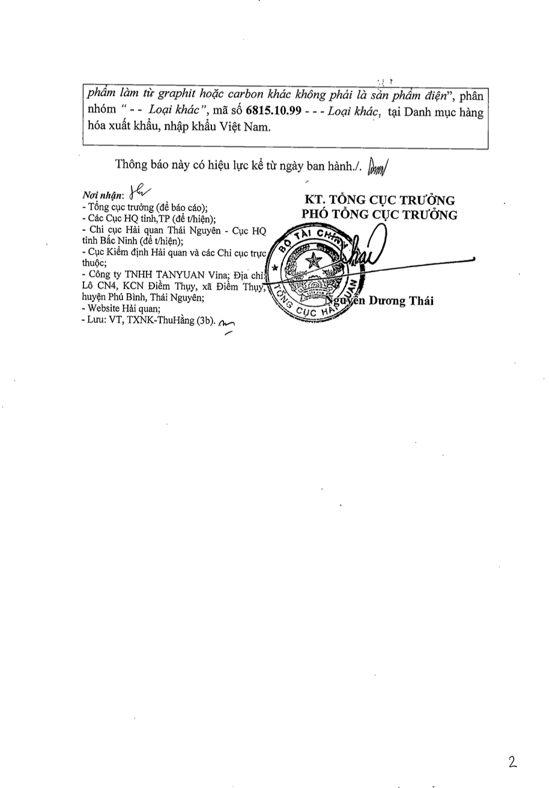
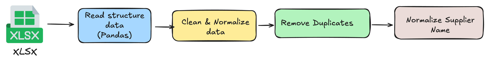

# SmartCustoms Assistant v1.1

**SmartCustoms-Assistant v1.1** is an advanced **Retrieval-Augmented Generation (RAG)** chatbot project focused on assisting users with **import/export regulations, customs procedures, and goods classification**. This latest version features significant improvements with **MongoDB integration**, **intelligent query routing**, and **enhanced performance** through advanced pooling strategies.

The chatbot leverages the reasoning capability of a **Large Language Model (LLM)** to generate responses, combined with a **vector-based retrieval system** and **MongoDB search capabilities** for grounding answers in relevant documents.

To **enhance factual accuracy and reduce hallucinations** in specialized customs-related queries (e.g., **HS code lookup, supplier name, product description, status**, etc.), the system integrates with **MongoDB** through an intelligent **Coordinator module** that decides between Vector Search and MongoDB methods based on query type.

The new **AggregatePipelineGenerator** allows dynamic creation of complex MongoDB queries using LLM, supporting fuzzy search, regex patterns, exact matching, and date range queries with customizable parameters.

This design **significantly improves information accuracy and domain-specific reliability**, making **SmartCustoms-Assistant v1.1** a powerful tool for supporting **professional customs consulting and compliance workflows**.

```
┌─────────────────┐    ┌─────────────────┐    ┌─────────────────┐
│   User Query    │───▶│   Coordinator   │───▶│  Search Engine  │
└─────────────────┘    └─────────────────┘    └─────────────────┘
                                │                        │
                                ▼                        ▼
                       ┌─────────────────┐    ┌─────────────────┐
                       │ MongoDB Search  │    │  Vector Search  │
                       └─────────────────┘    └─────────────────┘
                                │                        │
                                └────────┬───────────────┘
                                         ▼
                                ┌─────────────────┐
                                │  LLM Response   │
                                └─────────────────┘
```

---

## Table of Contents
<!-- TOC -->
- [SmartCustoms Assistant v1.1](#smartcustoms-assistant-v11)
  - [Table of Contents](#table-of-contents)
  - [🔄 What's New in v1.1](#-whats-new-in-v11)
  - [Objectives](#objectives)
  - [Overall Architecture](#overall-architecture)
    - [Data Ingestion](#data-ingestion)
    - [Chunking \& Preprocessing](#chunking--preprocessing)
    - [Embedding](#embedding)
    - [Query Analysis \& Routing](#query-analysis--routing)
    - [MongoDB Search Pipeline](#mongodb-search-pipeline)
    - [Query → Similarity Search](#query--similarity-search)
    - [Cohere Rerank](#cohere-rerank)
    - [MongoDB Integration](#mongodb-integration)
    - [LLM Generation](#llm-generation)
    - [Tracing \& Monitoring](#tracing--monitoring)
  - [App Structure](#app-structure)
  - [Key Features \& Improvements](#key-features--improvements)
    - [🔄 Database Migration: MySQL → MongoDB](#-database-migration-mysql--mongodb)
    - [🤖 Automated AggregatePipelineGenerator](#-automated-aggregatepipelinemodule)
    - [🧠 Coordinator Architecture](#-coordinator-architecture)
    - [📊 Smart Query Enhancements](#-smart-query-enhancements)
    - [⚙️ System Architecture Improvements](#-system-architecture-improvements)
    - [📝 Enhanced API Endpoints](#-enhanced-api-endpoints)
    - [🧰 Enhanced Prompting Tools](#-enhanced-prompting-tools)
  - [Data Processing Pipelines](#data-processing-pipelines)
    - [PDF Processing](#pdf-processing)
    - [Excel Processing](#excel-processing)
    - [DOC/DOCX Processing](#docdocx-processing)
  - [MongoDB Integration Details](#mongodb-integration-details)
    - [Database Schema](#database-schema)
    - [Search Techniques](#search-techniques)
  - [API Endpoints](#api-endpoints)
    - [Chat (Conversational API)](#chat-conversational-api)
    - [File Upload & Processing](#file-upload--processing)
    - [File Management](#file-management)
  - [Deployment Strategy](#deployment-strategy)
    - [Object Pooling](#object-pooling)
    - [Configuration](#configuration)
  - [Monitoring \& Tracing](#monitoring--tracing)
  - [Demo](#demo)
  - [Contributors](#contributors)
<!-- /TOC -->

---

## 🔄 What's New in v1.1

Version 1.1 represents a major architectural evolution with the following key improvements:

- **🔄 Complete MongoDB Migration**: Transition from MySQL to MongoDB for better scalability and flexibility
- **🧠 Intelligent Coordinator**: Automatic query routing between Vector Search and MongoDB Search
- **🤖 Dynamic Pipeline Generation**: LLM-powered MongoDB aggregation pipeline creation
- **⚙️ Enhanced Connection Pooling**: Advanced asynchronous connection and object pool management
- **📊 Improved Search Capabilities**: Fuzzy search, regex patterns, and dynamic thresholds
- **🧰 Centralized Prompting**: Organized prompt templates for better maintainability

---

## Objectives

- **Instantly respond** to user queries about **import/export regulations**, **customs clearance procedures**, **HS code classification**, and required documentation.
- **Minimize latency** while maintaining response quality by using **Cohere Reranker** with optimized reranking process and better integration into the pool-based architecture.
- **Intelligently route queries** using the new **Coordinator module** that acts as a router between Vector Search and MongoDB search based on query analysis. The MongoDB implementation leverages text search capabilities and aggregation pipelines for more flexible and powerful queries.
- **Seamlessly process multiple data formats** — from structured **Excel spreadsheets** to semi-structured or unstructured formats like **PDF and Word** documents, through a unified OCR + NLP pipeline. Excel data now flows into MongoDB collections with optimized indexes and search capabilities.
- **Implement dynamic query generation** with the **AggregatePipelineGenerator**, which creates MongoDB pipelines based on LLM analysis of user queries, supporting fuzzy matching, regex patterns, exact matching, and range queries.
- **Enhanced system architecture** with a fully **asynchronous design** using connection pools for database access and object pools for heavyweight components, significantly improving concurrency and response times.

---

## Overall Architecture

The v1.1 architecture follows a modular design with enhanced intelligence and performance:

### Data Ingestion
- Data is provided by stakeholders in various formats: `.pdf`, `.xlsx`, `.doc`, `.docx`.
- Each format is handled by a dedicated **Preprocessor** that extracts and prepares the content accordingly.

### Chunking & Preprocessing
- **Structured data (Excel)**: Store normalized data in MongoDB collections with optimized indexes for full-text search.
- **Unstructured data (PDF, Word)**: Use **semantic chunking** or sliding-window chunking with overlap.
- The output is a set of cleaned and normalized **text chunks** ready for vectorization.

### Embedding
- Use an **embedding model** (`text-embedding-3-large`) to convert each chunk into a vector.
- Store vectors in a **Vector Database** (Qdrant) for fast similarity search.

### Query Analysis & Routing
- The **Coordinator** analyzes user queries to determine the optimal processing strategy.
- Decides whether to use MongoDB-based search (for structured data queries) or Vector-based RAG (for unstructured knowledge queries).

### MongoDB Search Pipeline
- For structured data queries, the **AggregatePipelineGenerator** creates complex MongoDB pipelines using LLM.
- Supports multiple search types in one interface: fuzzy search, regex patterns, exact matching, and range queries.
- Implements **dynamic thresholds** with two-stage filtering for improved result quality.

### Query → Similarity Search
- For unstructured data queries, the user's question is embedded and used to search the **top-k most similar chunks** in the Vector DB.

### Cohere Rerank
- To reduce latency while maintaining relevance, **Cohere's Rerank API** is used instead of traditional Cross-Encoders.
- The top-k results are reranked to find the **top-n** most relevant chunks for final use.

### MongoDB Integration
- Direct MongoDB search capabilities provide improved flexibility and performance.
- Replaces the traditional ToolAgent approach with intelligent query coordination.

### LLM Generation
- A **Large Language Model (LLM)** uses the retrieved context (either from Vector DB or MongoDB) to generate a natural-language response.
- The result is returned to the user as the final answer.

### Tracing & Monitoring
- Use **LangSmith** for tracing, debugging, and monitoring the LLM pipeline.
- Extended tracing to include MongoDB query generation and execution metrics.

---

## App Structure

```
app-ver-1.1/                            
├── api/                        - API endpoints
│   ├── chat_endpoint.py        - Handles chat-related API endpoints
│   ├── delete_endpoint.py      - Manages delete operations via API
│   ├── doc_endpoint.py         - Processes DOC document-related API requests
│   ├── pdf_endpoint.py         - Manages PDF-related API endpoints 
│   ├── xlsx_delete.py          - Handles deletion of xlsx data on MongoDB
│   └── xlsx_endpoint.py        - Processes Excel file-related API endpoints
│
├── config.py                   - Enhanced configuration with MongoDB settings and pooling options
│
├── data/                       - Stores uploaded data
│   └── uploaded/               - Subdirectory for uploaded files
│
├── llms/                       - Large Language Model (LLM) processing modules
│   ├── aggregate_pipeline_generator.py - Generates MongoDB search pipelines using LLM
│   ├── coordinator.py          - Decides optimal search strategy (Vector vs MongoDB)
│   ├── embedding_generator.py  - Generates embeddings from data
│   ├── gpt_ocr.py              - OCR processing using GPT models
│   └── response_generator.py   - Generates responses using LLM
│
├── main.py                     - Application deployment with connection pool management
│
├── models/                     - Contains AI/ML models
│   └── yolov11_tuned.pt        - Fine-tuned YOLOv11 model for object detection
│
├── mongodb/                    - MongoDB integration modules
│   ├── mongodb_manager.py      - Manages MongoDB connections and operations
│   └── mongodb_search.py       - Implements search functionality through MongoDB
│
├── pipelines/                  - Data processing workflows
│   ├── doc_pipelines/          - Document processing for DOC/DOCX
│   ├── pdf_pipelines/          - PDF document processing with OCR
│   ├── rag_pipelines/          - Retrieval-Augmented Generation pipelines
│   └── xlsx_pipelines/         - Excel processing pipelines
│
├── prompts/                    - Centralized prompt templates for LLMs
│   ├── constants.py            - Constant values used in prompts
│   ├── mongo_pipeline.py       - Templates for MongoDB pipeline generation
│   ├── ocr_prompts.py          - Templates for OCR processing
│   ├── response_prompts.py     - Templates for response generation
│   ├── search_decision.py      - Templates for search decision-making
│   └── suggestion_templates.py - Templates for suggestion generation
│
├── utils/                      - Utility tools and helpers
│
└── requirements.txt            - Project dependencies
```

The app structure represents a significant evolution with key architectural improvements:

1. **Separation of concerns**: Better organized with dedicated directories for MongoDB operations, LLM processing, and prompt templates.
2. **Modular design**: Each component is isolated, making the system more maintainable and testable.
3. **Enhanced configuration**: Detailed settings for MongoDB, connection pools, and service parameters.
4. **Centralized prompts**: All LLM prompts are stored in a dedicated `prompts/` directory.
5. **Coordinator pattern**: Dynamic decision-making about optimal search strategies.

---

## Key Features & Improvements

### 🔄 Database Migration: MySQL → MongoDB

- **Complete transition** from MySQL to **MongoDB** to leverage powerful vector search and text search capabilities.
- Integration with **MongoDB Atlas Vector Search** allowing efficient similarity and fuzzy matching.
- Improved structured data search performance with better scalability.

### 🤖 Automated AggregatePipelineGenerator

- Introduction of **AggregatePipelineGenerator** - a tool that uses LLM to create complex MongoDB search pipelines from user queries.
- Support for multiple search types:
  - **Fuzzy search** with customizable parameters (maxEdits, prefixLength, maxExpansions)
  - **Regex search** for complex patterns
  - **Exact matching** for specific fields
  - **Range queries** especially for time periods

### 🧠 Coordinator Architecture

- Added **Coordinator** module to orchestrate optimal query processing strategies:
  - Determines when to use Vector Search and when to use MongoDB Search
  - Analyzes user queries to select the most effective search tool
  - Optimizes information retrieval strategy based on query characteristics

### 📊 Smart Query Enhancements

- Implemented **Dynamic Thresholds** for fuzzy search:
  - Pre-filtering with absolute threshold
  - Relative filtering compared to highest search score
- Combined **$search** and **$match** in MongoDB pipeline to optimize results
- Support for input data transformation (such as date formatting) before searching

### ⚙️ System Architecture Improvements

- **Enhanced Connection Pool** design:
  - MongoDB connection pool management with customizable configuration
  - Optimization of pool parameters (maxPoolSize, minPoolSize, maxIdleTimeMS)
- **Reorganized module** architecture:
  - Added `prompts/` directory containing all templates and schemas for LLM
  - Separated `llms/` and `mongodb/` into distinct modules
  - Object Pool system for all heavyweight components (VectorStore, Reranker, Pipeline Generator)

### 📝 Enhanced API Endpoints

- Enhanced API endpoints:
  - `/api/chat` supporting intelligent queries via MongoDB or RAG depending on question type
  - Document processing endpoints optimized for synchronized storage between Vector DB and MongoDB

### 🧰 Enhanced Prompting Tools

- Added detailed template files for MongoDB search and decision-making functionality
- Templates are parameterized and centralized in one directory, making updates and maintenance easier

---

## Data Processing Pipelines


### PDF Processing


**Enhanced OCR Pipeline with YOLOv11 + GPT-4**

- **YOLOv11 Preprocessing**: Detects and masks sensitive content (seals, signatures) before OCR
- **GPT-4 OCR**: High-accuracy text extraction with Vietnamese optimization
- **Tesseract Fallback**: Backup OCR for cases where GPT-4 fails
- **Smart Chunking**: Token-based splitting with overlap for context preservation

**Sample Data:**
<div style="display: flex; justify-content: space-between;">
  
  
</div>

### Excel Processing



**MongoDB-Optimized Pipeline**

- **Data Normalization**: Clean and standardize Excel data
- **MongoDB Storage**: Store normalized data with optimized indexes
- **Full-text Search**: Leverage MongoDB Atlas search capabilities
- **Status Classification**: Automatic Import/Export categorization

**Sample Data:**


### DOC/DOCX Processing


**LibreOffice + NLP Pipeline**

- **Format Conversion**: DOC → DOCX using LibreOffice headless mode
- **Content Extraction**: Structured text extraction
- **Regex Chunking**: Smart splitting by document sections
- **Context Preservation**: Overlap between chunks for continuity

**Sample Data:**


---

## MongoDB Integration Details

### Search Techniques

1. **Fuzzy Search**: MongoDB Atlas Search with configurable edit distance
2. **Text Search**: Full-text search with Vietnamese language support
3. **Exact Matching**: Precise field matching for codes and identifiers
4. **Range Queries**: Date and numeric range searches
5. **Compound Queries**: Complex multi-field search combinations

---

## API Endpoints


### Chat (Conversational API)
- **Route**: `POST /api/chat`
- **Enhanced Features**: Intelligent query routing via Coordinator
- **MongoDB Integration**: Direct structured data queries when appropriate
- **Fallback**: Vector-based RAG for unstructured knowledge

### File Upload & Processing
- **Route**: `POST /api/pdf_endpoint` - Upload and process PDF files
- **Route**: `POST /api/xlsx_endpoint` - Upload and process Excel files  
- **Route**: `POST /api/doc_endpoint` - Upload and process DOC/DOCX files
- **Formats**: PDF, DOC/DOCX, Excel
- **Storage**: Synchronized storage in both Vector DB and MongoDB

### File Management
- **Route**: `GET /api/files` - List uploaded files
- **Route**: `DELETE /api/delete` - Delete PDF/DOC files and associated data from Qdrant
- **Route**: `DELETE /api/xlsx_delete` - Delete Excel data from MongoDB

---

## Deployment Strategy

### Object Pooling

**Optimized for Low Latency**

The system implements advanced **Object Pooling** using `asyncio.Queue` for:

- `VectorStoreManager` and `SearchEngine` instances
- `AsyncCohereReranker` instances  
- `AggregatePipelineGenerator` instances
- `Coordinator` instances

### Configuration

**Environment Variables:**
```bash
# MongoDB Configuration
MONGODB_URI=mongodb://localhost:27017
MONGODB_DATABASE=smartcustoms
MONGODB_POOL_SIZE=10

# OpenAI
OPENAI_API_KEY=your_openai_key

# Cohere
COHERE_API_KEY=your_cohere_key

# Qdrant
QDRANT_URL=http://localhost:6333

# Pool Sizes
VECTOR_STORE_POOL_SIZE=3
RERANKER_POOL_SIZE=2
COORDINATOR_POOL_SIZE=2
```

---

## Monitoring & Tracing

**Enhanced LangSmith Integration**

- **MongoDB Query Tracing**: Track aggregation pipeline generation and execution
- **Coordinator Decisions**: Monitor query routing decisions
- **Performance Metrics**: Enhanced latency and token usage tracking
- **Error Handling**: Comprehensive error tracking and debugging
