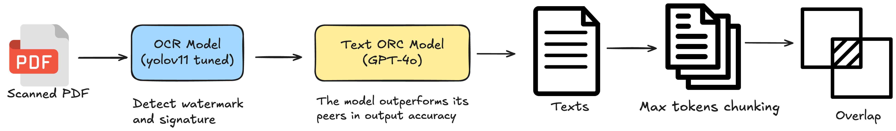
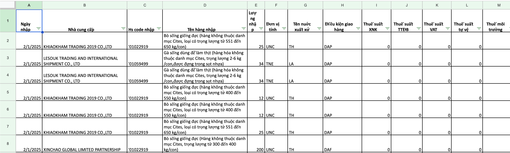
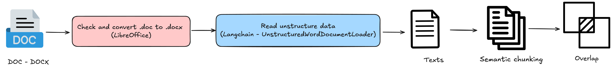

# SmartCustoms Assistant v1.0

**SmartCustoms-Assistant v1.0** is a **Retrieval-Augmented Generation (RAG)** chatbot project focused on assisting users with **import/export regulations, customs procedures, and goods classification**. The chatbot leverages the reasoning capability of a **Large Language Model (LLM)** to generate responses, combined with a **vector-based retrieval system** for grounding answers in relevant documents.

To **enhance factual accuracy and reduce hallucinations** in specialized customs-related queries (e.g., **HS code lookup, supplier name, product description, status**, etc.), the system is integrated with a dedicated module called **ToolAgent**.

**ToolAgent** plays a critical role by retrieving **exact data from the MySQL database**, supplementing the LLM with real-time factual information rather than relying solely on the model's internal knowledge or inference.

This design **significantly improves information accuracy and domain-specific reliability**, making **SmartCustoms-Assistant** a powerful tool for supporting **professional customs consulting and compliance workflows**.


---

## Table of Contents
<!-- TOC -->
- [SmartCustoms Assistant v1.0](#smartcustoms-assistant-v10)
  - [Table of Contents](#table-of-contents)
  - [Objectives](#objectives)
  - [Overall Architecture](#overall-architecture)
    - [Data Ingestion](#data-ingestion)
    - [Chunking \& Preprocessing](#chunking--preprocessing)
    - [Embedding](#embedding)
    - [Query → Similarity Search](#query--similarity-search)
    - [Cohere Rerank](#cohere-rerank)
    - [Tool-Agent Support](#tool-agent-support)
    - [LLM Generation](#llm-generation)
    - [Tracing \& Monitoring](#tracing--monitoring)
  - [App Structure](#app-structure)
  - [Data Processing Pipelines](#data-processing-pipelines)
    - [PDF Processing](#pdf-processing)
    - [Excel Processing](#excel-processing)
    - [DOC/DOCX Processing](#docdocx-processing)
  - [RAG Pipeline Components](#rag-pipeline-components)
    - [VectorStoreManager](#vectorstoremanager)
    - [Reranker](#reranker)
    - [SearchEngine](#searchengine)
  - [LLM Pipeline \& Tool Agent](#llm-pipeline--tool-agent)
    - [DataLoader](#dataloader)
    - [EmbeddingGenerator](#embeddinggenerator)
    - [ResponseGenerator](#responsegenerator)
    - [ToolAgent](#toolagent)
  - [MySQL Database \& Tools](#mysql-database--tools)
    - [Database Schema](#database-schema)
    - [Search Techniques](#search-techniques)
      - [🔍 Fuzzy Matching (Supplier Resolution)](#-fuzzy-matching-supplier-resolution)
      - [🧠 Full-Text Search (for product name or description)](#-full-text-search-for-product-name-or-description)
      - [🧾 HS Code Search with LIKE Prefix Matching](#-hs-code-search-with-like-prefix-matching)
    - [Summary of Techniques](#summary-of-techniques)
  - [API Endpoints](#api-endpoints)
    - [Chat (Conversational API)](#chat-conversational-api)
    - [File Upload & Processing](#file-upload-processing)
    - [File Management](#file-management)
  - [Deployment Strategy](#deployment-strategy)
    - [Object Pooling](#object-pooling)
    - [Configuration](#configuration)
  - [Monitoring \& Tracing](#monitoring--tracing)
  - [Demo](#demo)
  - [Contributors](#contributors)
<!-- /TOC -->

---

## Objectives

- **Instantly respond** to user queries about **import/export regulations**, **customs clearance procedures**, **HS code classification**, and required documentation.
- **Minimize latency** while maintaining response quality by using **Cohere Reranker** to rank relevant context efficiently.
- **Integrate ToolAgent** to accurately query information related to **HS codes**, **suppliers**, **product descriptions**, and more from MySQL database with sophisticated fuzzy matching and full-text search capabilities.
- **Seamlessly process multiple data formats** — from structured **Excel spreadsheets** to semi-structured or unstructured formats like **PDF and Word** documents, through a unified OCR + NLP pipeline.
- **Maintain high accuracy** in customs-related information through exact database lookups and fallback to RAG for general knowledge queries.

---

## Overall Architecture

The project follows a modular architecture with the following key stages:

### Data Ingestion
- Data is provided by stakeholders in various formats: `.pdf`, `.xlsx`, `.doc`, `.docx`.
- Each format is handled by a dedicated **Preprocessor** that extracts and prepares the content accordingly.

### Chunking & Preprocessing
- **Structured data (Excel)**: Apply preprocessing and normalization, then store cleaned data in MySQL.
- **Unstructured data (PDF, Word)**: Use **semantic chunking** or sliding-window chunking with overlap.
- The output is a set of cleaned and normalized **text chunks** ready for vectorization.

### Embedding
- Use an **embedding model** (`text-embedding-3-large`) to convert each chunk into a vector.
- Store vectors in a **Vector Database** (Qdrant) for fast similarity search.

### Query → Similarity Search
- The user's question is embedded and used to search the **top-k most similar chunks** in the Vector DB.

### Cohere Rerank
- To reduce latency while maintaining relevance, **Cohere's Rerank API** is used instead of traditional Cross-Encoders.
- The top-k results are reranked to find the **top-n** most relevant chunks for final use.

### Tool-Agent Support
- An integrated **ToolAgent** retrieves exact data from MySQL for specific lookups (HS codes, supplier information, product details).
- This improves the **precision of factual responses** and allows for external information retrieval where needed.

### LLM Generation
- A **Large Language Model (LLM)** uses the retrieved context (either from Vector DB or ToolAgent) to generate a natural-language response.
- The result is returned to the user as the final answer.

### Tracing & Monitoring
- Use **LangSmith** for tracing, debugging, and monitoring the LLM pipeline.
- Track prompt flows, latency, and intermediate states for better observability and iterative improvement.

---

## App Structure

```
app/                            
├── api/                        - Contains the application's API endpoints
│   ├── chat_endpoint.py        - Handles chat-related API endpoints
│   ├── delete_endpoint.py      - Manages delete operations via API
│   ├── doc_endpoint.py         - Processes DOC document-related API requests
│   ├── pdf_endpoint.py         - Manages PDF-related API endpoints 
│   ├── xlsx_delete.py          - Handles deletion of xlsx data on MySQL
│   └── xlsx_endpoint.py        - Processes Excel file-related API endpoints
│
├── config.py                   - Configuration settings
│
├── data/                       - Stores uploaded data
│   └── uploaded/               - Subdirectory for uploaded files
│
├── main.py                     - Application deployment
│
├── models/                     - Contains AI/ML models
│   └── yolov11_tuned.pt        - Fine-tuned YOLOv11 model for object detection
│
├── pipelines/                  - Organizes data processing workflows
│   ├── doc_pipelines/          - Handles doc, docx document processing
│   │   └── doc_processor.py    - Document processing logic
│   ├── llm_pipelines/          - Large Language Model (LLM) processing
│   │   ├── agent_decision.py   - Decision-making logic for agents
│   │   ├── data_preparation.py - Prepares data for LLM processing
│   │   ├── embedding_generator.py - Generates embeddings from data
│   │   └── response_generator.py - Generates responses using LLM
│   ├── pdf_pipelines/          - Handles PDF document processing
│   │   ├── gpt_ocr.py          - Uses GPT for optical character recognition (OCR) on PDFs
│   │   ├── image_processor.py  - Processes images from PDFs
│   │   ├── pdf_processor.py    - PDF document processing logic
│   │   └── yolo_detector.py    - Uses YOLO for object detection in PDF images
│   ├── rag_pipelines/          - Supports advanced retrieval (RAG)
│   │   ├── cohere_reranker.py  - Uses Cohere to rerank results
│   │   ├── search_engine.py    - Search engine using RAG techniques
│   │   └── vector_store.py     - Manages storage of embedding vectors
│   └── xlsx_pipelines/         - Handles Excel document processing
│       └── xlsx_processor.py   - Excel document processing logic
│
├── tools/                      - Contains tools for embedding into Agent
│   ├── hscode.py               - Core HS code processing
│   ├── hscode_status.py        - HS code status processing
│   ├── hscode_supplier.py      - HS code logic related to suppliers
│   ├── hscode_supplier_date_status.py - HS code by supplier, date, and status
│   ├── hscode_supplier_daterange_status.py - HS code by date range and status
│   ├── hscode_supplier_status.py - HS code by supplier and status
│   ├── productname.py          - Product name processing
│   ├── supplier_resolver.py    - Resolves supplier information (using fuzzy matching)
│
├── utils/                      - Provides utility tools
│   ├── db_connector.py         - Database connection logic
│   └── hscode_formatter.py     - Formats results from queries
│
└── requirements.txt            - List of project dependencies
```

---

## Data Processing Pipelines


### PDF Processing



**Advanced OCR Pipeline with YOLOv11 + GPT-4**

- **Data Source**: Official PDF documents (scanned-image PDFs with no embedded text layer)
- **YOLOv11 Preprocessing**: Detects and masks sensitive content (seals, signatures) using trained model
- **GPT-4 OCR**: High-accuracy text extraction with Vietnamese-optimized prompts
- **Tesseract Fallback**: Backup OCR with Vietnamese language support (`lang='vie'`)
- **Smart Chunking**: Token-based splitting with overlap for context preservation

**Approach Details:**
1. Convert PDF pages to images
2. Use YOLOv11 to detect and mask sensitive elements
3. Extract text using GPT-4 with structured Markdown output
4. Fallback to Tesseract if GPT-4 fails or returns minimal text
5. Apply intelligent chunking with overlap

**Sample Data:**
<div style="display: flex; justify-content: space-between;">
  
  
</div>

**References & Links:**
- [Raw Data & Data Preparation Notebook](https://drive.google.com/drive/folders/1nD3ke0PfkfS4P8bNWKQwbXDsn6vUw1aR?usp=sharing)
- [YOLOv11 Dataset (Roboflow)](https://universe.roboflow.com/watermarkdetect/watermark_signature_sensitive_if)
- [Original Data Source](https://camnangxnk-logistics.net/tai-lieu-xuat-nhap-khau/bo-tai-chinh/)
- [YOLOv11 Finetune Notebook](https://colab.research.google.com/drive/1YwCLxD8-CZWpznqOhZ2hnRjyz2daWrX0?usp=sharing)

### Excel Processing


**MySQL-Optimized Data Pipeline**

- **Data Source**: Excel files with structured import/export data
- **Processing Steps**:
  1. Read Excel data using pandas
  2. Add Status column (Import/Export classification)
  3. Rename and standardize first 13 columns
  4. Clean and normalize data (dates, strings, numbers)
  5. Remove duplicates and add file tracking
  6. Normalize supplier names with standardization
  7. Store in MySQL with proper schema validation

**Sample Data:**


### DOC/DOCX Processing



**LibreOffice + NLP Pipeline**

- **Data Source**: Word files containing government decrees and regulations
- **Processing Steps**:
  1. Convert DOC to DOCX using LibreOffice headless mode
  2. Extract content using UnstructuredWordDocumentLoader
  3. Apply regex splitting by document sections ("Điều", "Khoản", "Mẫu số")
  4. Intelligent chunking with token counting and overlap

**Sample Data:**


---

## RAG Pipeline Components

### VectorStoreManager
- Manages **storage** and **retrieval** of vector embeddings via **Qdrant**
- Creates Qdrant collection based on **embedding dimensions**
- Stores text and metadata as vectors, enabling **similarity search**

### Reranker
- Enhances accuracy by re-ranking initially retrieved documents
- Utilizes **Cohere Rerank**, a cloud-based reranking model
- Optimized for environments **without GPU**, reducing latency while maintaining quality
- Returns top-ranked documents in descending order of relevance

### SearchEngine
- Uses VectorStore for **initial retrieval** and filters by threshold
- Retrieves top-k documents by similarity, discarding those below threshold

---

## LLM Pipeline & Tool Agent

### DataLoader
- Extracts text content and metadata from JSON (processed PDFs, DOCX)

### EmbeddingGenerator
- Converts text into vector embeddings using OpenAI Embeddings
- Supports batch splitting and retry mechanisms for efficient API calls

### ResponseGenerator
- Utilizes ChatOpenAI to generate final responses via custom prompts
- Offers both fallback responses (general knowledge) and RAG-based responses

### ToolAgent
- Manages and integrates specialized tools for querying HS codes, product names, supplier data
- Initializes an agent using OpenAI functions that dynamically decides tool invocation
- Aggregates results from multiple tools for comprehensive responses

---

## MySQL Database & Tools

### Database Schema

```mysql
CREATE TABLE IF NOT EXISTS import_data (
    id INT AUTO_INCREMENT PRIMARY KEY,
    Ngay DATE,
    NhaCungCap VARCHAR(255),
    HsCode VARCHAR(50),
    TenHang VARCHAR(255),
    Luong INT,
    DonViTinh VARCHAR(50),
    TenNuocXuatXu VARCHAR(50),
    DieuKienGiaoHang VARCHAR(50),
    ThueSuatXNK DECIMAL(5,2),
    ThueSuatTTDB DECIMAL(5,2),
    ThueSuatVAT DECIMAL(5,2),
    ThueSuatTuVe DECIMAL(5,2),
    ThueSuatBVMT DECIMAL(5,2),
    file_name VARCHAR(255),
    TinhTrang VARCHAR(50),
    FULLTEXT KEY ft_tenhang (TenHang)
) ENGINE=InnoDB DEFAULT CHARSET=utf8mb4;
```

### Search Techniques

#### 🔍 Fuzzy Matching (Supplier Resolution)
- **Component**: `SupplierResolver`
- **Library**: [rapidfuzz](https://github.com/maxbachmann/RapidFuzz)
- **Technique**: Uses `fuzz.WRatio` to compute similarity scores
- **Thresholds**: 
  - Accepts matches with score ≥ 80
  - Prioritizes exact matches with score ≥ 90
- **Application**: Handles typos and variations in supplier names

#### 🧠 Full-Text Search (for product name or description)
- **Components**: `ProductNameSearchTool`, `ProductNameStatusTool`, etc.
- **Technique**: Leverages SQL's `MATCH ... AGAINST` with Natural Language Mode
- **Post-processing**: Fuzzy filtering with ≥ 80% similarity threshold
- **Benefits**: Context-aware search instead of exact string matching

#### 🧾 HS Code Search with `LIKE` Prefix Matching
- **Components**: `HSCodeTool`, `HSCodeSupplierTool`, etc.
- **Technique**: SQL queries using `LIKE` operator (e.g., `HSCode LIKE '1234%'`)
- **Application**: Efficient lookup for partial HS codes
- **Use Case**: Hierarchical HS code navigation

### Summary of Techniques

| Technique              | Purpose                                             | Threshold/Logic     |
|------------------------|-----------------------------------------------------|----------------------|
| `fuzz.WRatio`          | Resolve supplier names with fuzzy match             | 80 (pass), 90 (exact)|
| `MATCH ... AGAINST`    | Contextual product name search in DB               | -                    |
| Fuzzy Filtering        | Filter full-text search results post-query          | 80% similarity       |
| SQL `LIKE` on HS Code  | Partial match for HS code                           | Pattern: `{input}%` |

---

## API Endpoints


### Chat (Conversational API)
- **Route**: `POST /api/chat`
- **Features**: 
  - Session-based conversations using `session_id` cookie
  - ToolAgent integration for structured data queries
  - RAG fallback for general knowledge questions
- **Decision Logic**: ToolAgent decides between tool invocation and RAG pipeline

### File Upload & Processing
- **Route**: `POST /api/pdf_endpoint` - Upload and process PDF files
- **Route**: `POST /api/xlsx_endpoint` - Upload and process Excel files
- **Route**: `POST /api/doc_endpoint` - Upload and process DOC/DOCX files
- **Features**:
  - File size limit: 10MB
  - Automatic processing and vectorization
  - Storage in appropriate databases (Qdrant for PDF/DOC, MySQL for Excel)

### File Management
- **Route**: `GET /api/files` - List uploaded files
- **Route**: `DELETE /api/delete` - Delete PDF/DOC files and vectors from Qdrant
- **Route**: `DELETE /api/xlsx_delete` - Delete Excel data from MySQL
- **Features**: Complete data lifecycle management

---

## Deployment Strategy

### Object Pooling

**Optimized for Low Latency**

The system implements **Object Pooling** using `asyncio.Queue` for:

- `VectorStoreManager` and `SearchEngine` instances
- `AsyncCohereReranker` instances
- `ToolAgent` instances

### Configuration

**Environment Variables:**
```bash
# MySQL Configuration
MYSQL_HOST=localhost
MYSQL_USER=root
MYSQL_PASSWORD=password
MYSQL_DATABASE=smartcustoms

# OpenAI
OPENAI_API_KEY=your_openai_key

# Cohere
COHERE_API_KEY=your_cohere_key

# Qdrant
QDRANT_URL=http://localhost:6333

# Pool Sizes
VECTOR_STORE_POOL_SIZE=3
RERANKER_POOL_SIZE=2
TOOL_AGENT_POOL_SIZE=2
```

---

## Monitoring & Tracing

**LangSmith Integration**

- **Token Usage**: Track API costs and usage patterns
- **Latency**: End-to-end response time monitoring
- **Agent Workflow**: Step-by-step tool invocation tracing
- **MySQL Queries**: Complete database operation logging
- **Context Analysis**: Full prompt and retrieval context tracking

